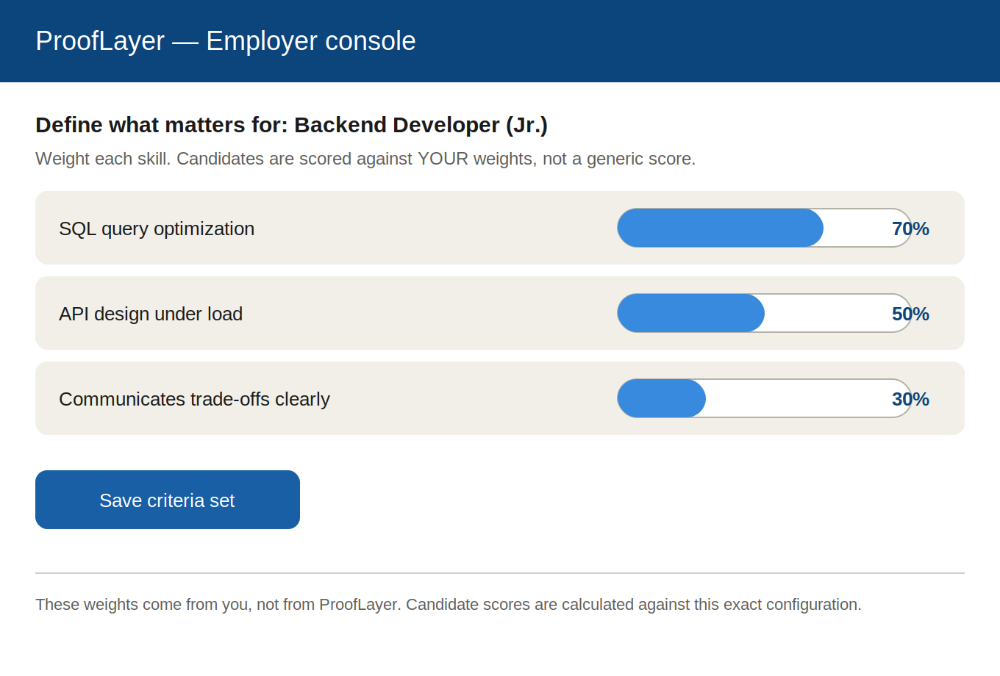
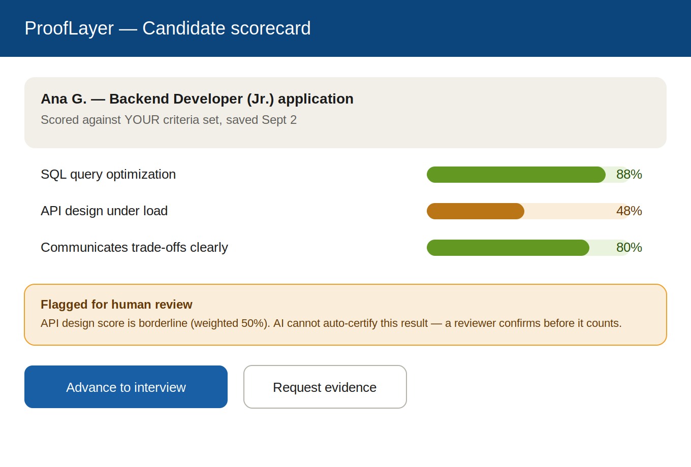
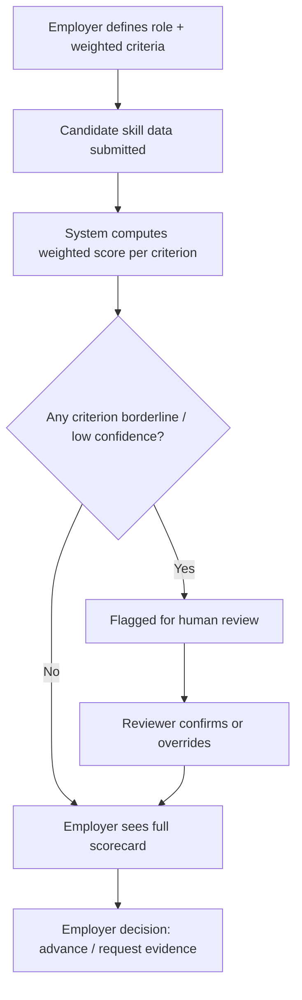
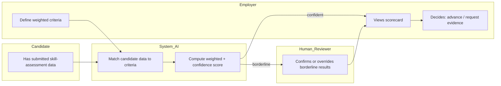

# PACKET — Business Bending, Week 4
**Gonzalo Patlán · Role: ADVERSARY · Condition owned: 1 (Employer trust from day one)**

## Problem, in my words
Proof-of-Skill only closes the opportunity gap if employers actually trust the score. Every prior attempt at skills certification I found in my Adversary round (CLIC) failed on exactly this point: it measured the student, never involved the employer, and ended up as another badge nobody in hiring actually uses. My slice tests whether letting the *employer* — not a platform, not a government chamber — define and weight the criteria a candidate is scored against is enough to make the score feel trustworthy, or whether it's still just a nicer-looking badge.

## Exact user
A hiring manager or small-team lead at a Mexican company (10–200 employees) who is filling an entry-level or junior technical role, has been burned before by a resume or an ATS "match score" that turned out meaningless, and won't advance a candidate on a score they can't explain.

## Success definition
Before the module closes: an employer can define and weight at least 3 skill criteria for a role, submit a candidate's (simulated, labeled) skill-assessment data, and see a scorecard computed against *their own* weights — with any borderline result routed to human review instead of auto-approved — and state whether they would trust it enough to advance the candidate to interview.

## Mockup
**Screen 1 — Criteria builder** (employer sets weights per skill):

**Screen 2 — Candidate scorecard** (scored against employer's own weights, borderline flagged for human review):

## Flow — flowchart

## Flow — swimlane (who does what)

## Benchmark — GLOBAL → LOCAL
The best existing solution on Earth for this is **CONOCER**, Mexico's own tripartite skills-certification body — employer chambers (COPARMEX, CONCAMIN) sit inside the governing committee that designs the standard, which is why its certificate actually carries weight in hiring.

Mine differs by moving that same principle — employer-defined trust — down from a national, years-long institutional process to a single employer configuring their own weighted criteria per role, in minutes, with no chamber or ministry required. It trades CONOCER's national legitimacy for speed and specificity; the open question this slice tests is whether that trade still produces a score an individual employer will actually act on.

## Long view (3 years)
If this slice works, the full product becomes the layer employers configure once per role and reuse across every candidate who applies through it — turning "employer-defined trust" into a reusable asset instead of a one-off judgment call. Over time, patterns across many employers' criteria sets could feed back into what gets taught and assessed upstream, function as a live, crowd-sourced qualifications framework built by demand rather than by decree. At that point the product isn't competing with CONOCER — it's the fast, bottom-up version of the same trust architecture.

## Scope cut — what I am NOT building
- The actual AI grading/skill-assessment engine (candidate skill data is simulated and labeled on screen).
- The student-facing side of Proof-of-Skill (Fernando's slice as USER).
- The human-bridge-to-opportunity flow — interviews, applications, offers (Cristina's slice as MONEY).
- Multi-employer discovery/marketplace, payments, or ATS integrations.
- Any onboarding/low-connectivity handling (OPERATOR's slice).

## Architecture + stack

| Layer | Choice | Notes |
|---|---|---|
| Frontend | Next.js on Vercel | Two screens: criteria builder, scorecard |
| Auth | Supabase Auth — Sign in with Google | Employer accounts only this slice |
| Database | Supabase Postgres | Tables: `criteria_sets`, `candidate_scores` |
| Row Level Security | ON | Employer sees only their own `criteria_sets` and `candidate_scores` |
| AI layer | LLM API call | Generates the borderline-confidence explanation shown to employer; labeled "AI-generated, simulated" on screen |
| Secrets | Vercel environment variables | No keys in repo |
| Input validation | Server-side | Weight values numeric 0–100, criteria labels length-capped |
| Seed data | Invented candidates only | No real personal data, labeled as fictional |

## Test plan

**Mechanical pass:** create a role, add 3 weighted criteria, submit a simulated candidate profile, confirm the scorecard reflects the exact weights entered, confirm a deliberately borderline score routes to human review and blocks auto-advance, confirm RLS blocks a second test employer account from seeing the first employer's data. Find and fix at least one bug, redeploy.

**Persona test (Layer 1):** persona is a skeptical Mexican hiring manager — mid-40s, runs a small logistics or services company, was burned before by an ATS "AI match score" that filled the pipeline with false positives, now distrusts any score she can't explain to her own team. Walk her through both screens via screenshots, in order, narrating where she hesitates or would abandon the flow, and specifically whether seeing *her own* weights reflected back — versus a generic AI badge — changes whether she trusts the number enough to advance a candidate. Log every point of confusion; fix the worst one before the deadline.
