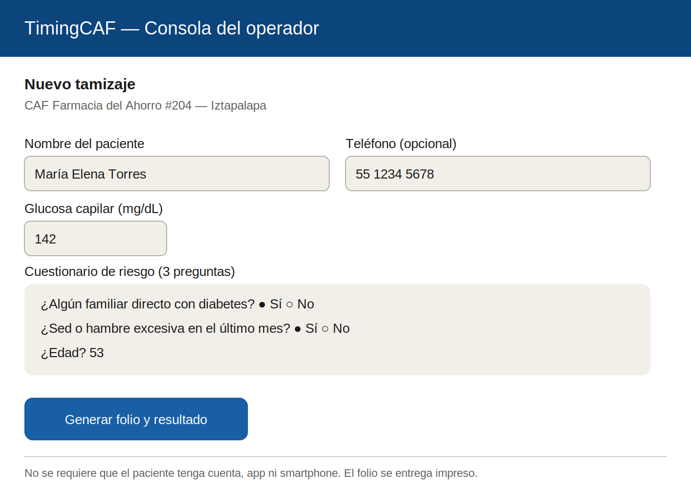
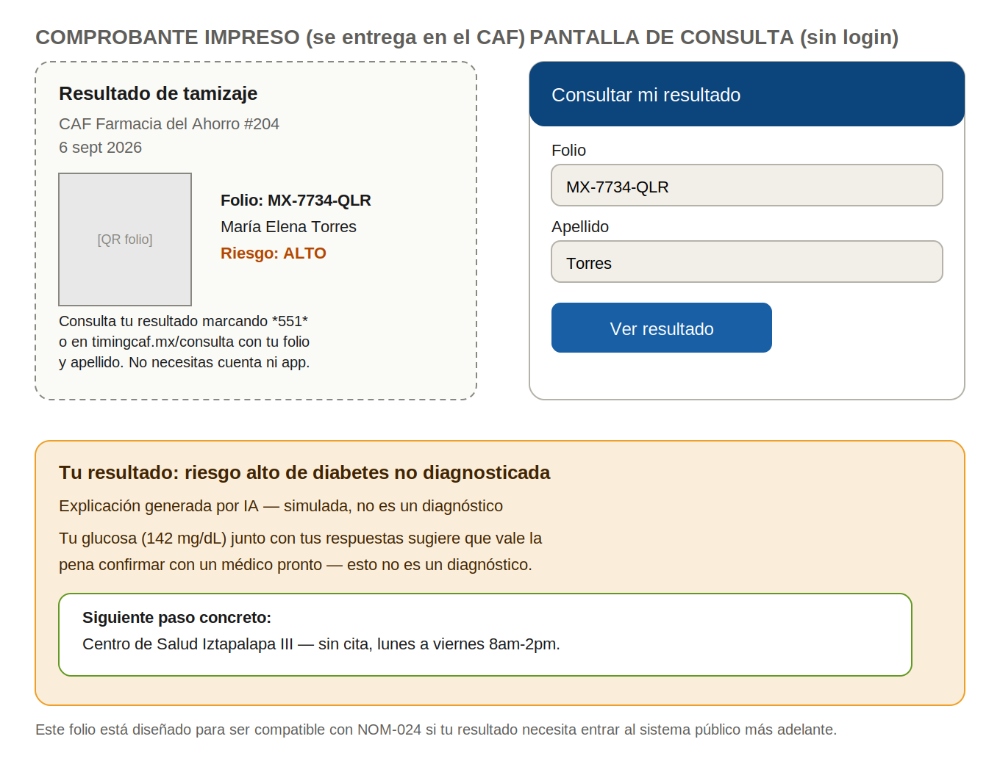
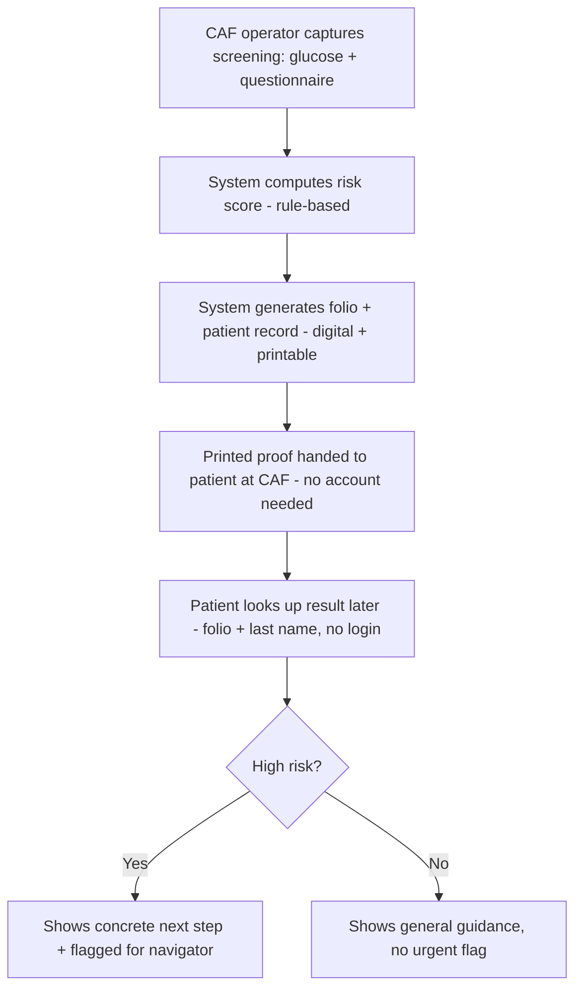
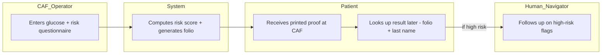

# PACKET — Business Bending, Week 5
**Gonzalo Patlán · Role: OPERATOR/TECHNOLOGIST · Blueprint declaration: pharmacy/CAF deployment + patient-owned record**

## Problem, in my words
Detection without a record the patient can actually keep and use is worthless — and in Mexico, "keep and use" can't assume a smartphone, an account, or an existing digital identity. My slice tests whether a screening result captured at a pharmacy-adjacent clinic (CAF) can become a portable, patient-owned record that works for someone with only a basic phone or none at all, while still being built to enter the public health system later if interoperability arrives. This directly honors Condition 4 (accessible by design) and Condition 5 (portable, patient-owned data) from our Blueprint.

## Exact user
The patient: a 50-something informal worker screened at a CAF during a routine pharmacy visit, who has no smartphone, no existing digital health account, and needs something physical she can hold onto — and later use, with or without help from someone else — to act on a result she doesn't fully understand on the spot.

## Success definition
Before the module closes: a CAF operator can capture a simulated screening (glucose reading + a short risk questionnaire), the system generates a folio-based record with a printed proof, and the patient (or a fresh persona standing in for her) can retrieve that same result later using only the folio and her last name — no login, no app, no smartphone required — and see one concrete next step tied to a real-sounding local clinic.

## Mockup
**Screen 1 — CAF operator capture:**

**Screen 2 — Printed proof + patient lookup (no login):**

## Flow — flowchart

## Flow — swimlane (who does what)

## Benchmark — GLOBAL to LOCAL
The best existing solution on Earth for this is **India's Ayushman Bharat Digital Mission (ABHA)** health ID — a national system explicitly designed to work for people without smartphones, linking a health record to an ID number that can be verified offline or through a paper/QR credential, built from day one toward interoperability with India's public health system.

Mine differs by not waiting for a national mandate: India's ABHA is a government-led digital health ID rollout; Mexico has no equivalent national interoperability body active yet (sectoral interoperability between IMSS, IMSS-Bienestar, and ISSSTE isn't targeted until early 2027). My slice starts at the CAF level with a simple folio system designed to already be NOM-024-shaped — so when national interoperability does arrive, this record is closer to something that can plug in, instead of another private silo that needs to be rebuilt from scratch.

## Long view (3 years)
If this slice works, the folio format could become a de facto standard that pharmacy chains adopt across CAFs, so a screening result follows the patient across pharmacy brands, not just within one company's app. When Mexico's targeted 2027 interoperability rollout lands, records already built in this format become easier to ingest than ones built as closed private systems. At that point the product isn't just a screening tool — it's the connective tissue between private pharmacy-based detection and whatever the public system eventually builds.

## Scope cut — what I am NOT building
- The actual clinical risk model (glucose + questionnaire scoring is rule-based and simulated, clearly labeled).
- The human navigator's case-management tool (that's the OPERATOR teammate's separate slice on the detection-to-treatment workflow).
- Payment or unit economics for the screening (Fernando/MONEY's slice).
- Patient-side comparison of doctors, price, or location (USER's slice).
- Any real integration with IMSS/ISSSTE/IMSS-Bienestar systems (none are available to integrate with today).
- Real retinal photography or wearable data — this week's structured signal is the glucose reading + questionnaire, simulated and labeled.

## Architecture + stack

| Layer | Choice | Notes |
|---|---|---|
| Frontend | Next.js on Vercel | Two flows: CAF operator capture, public patient lookup |
| Auth | Supabase Auth — Google sign-in | CAF operator accounts only; patient lookup has NO login |
| Database | Supabase Postgres | Tables: `screenings` (operator-owned), looked up publicly by folio + last name via a narrow server action |
| Row Level Security | ON for `screenings` (operator can only see their own captures) | Patient lookup path is a separate, tightly-scoped public server action — not a public table read |
| AI layer | LLM API call | Generates the plain-language explanation shown to the patient; labeled "Explicación generada por IA — simulada, no es un diagnóstico"; the risk score itself stays rule-based |
| Secrets | Vercel environment variables | No keys in repo |
| Input validation | Server-side | Glucose numeric range check, questionnaire answers constrained, folio+last-name lookup rate-limited to prevent enumeration |
| Seed data | Invented patients only | No real personal data, labeled fictional |

## Test plan

**Mechanical pass:** capture one high-risk and one low-risk simulated patient at the CAF screen, confirm each generates a distinct folio and printed proof, confirm the patient lookup screen returns the correct record with folio + last name and rejects a wrong combination, confirm a second CAF operator account cannot see the first operator's captured screenings in their dashboard. Find and fix at least one bug, redeploy.

**Persona test (Layer 1):** persona is a 54-year-old woman who sells food outside a metro station, has a basic phone with no data plan, distrusts apps, reads slowly. Walk her through receiving the printed proof and, days later, trying to look up her result — using a neighbor's phone or a cybercafé — via screenshots of both screens in order. Narrate where she hesitates, whether the folio+last-name flow makes sense without any prior explanation, and whether the concrete next step reads as something she could actually act on. Log every point of confusion; fix the worst one before the deadline.
