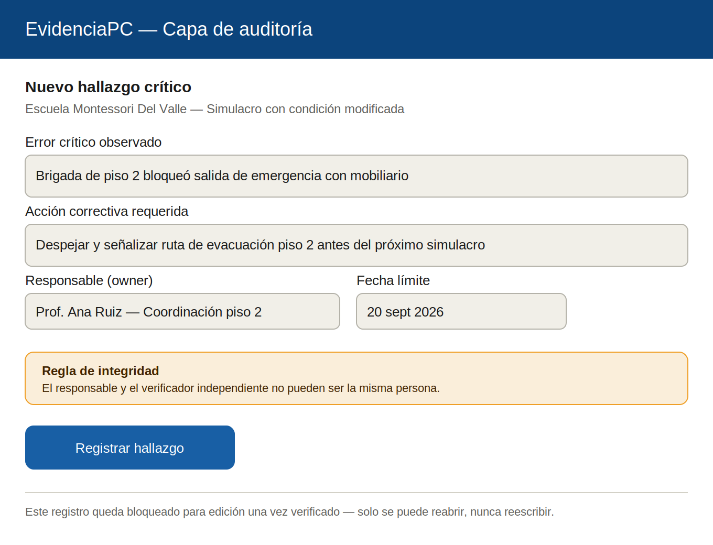
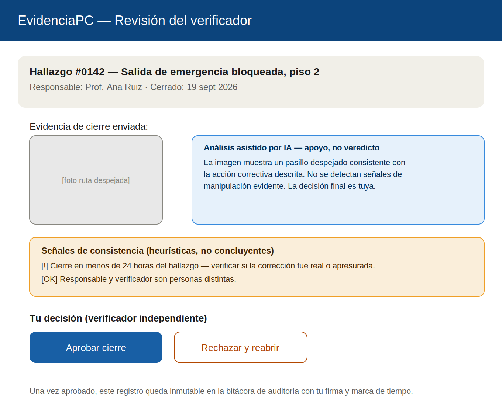
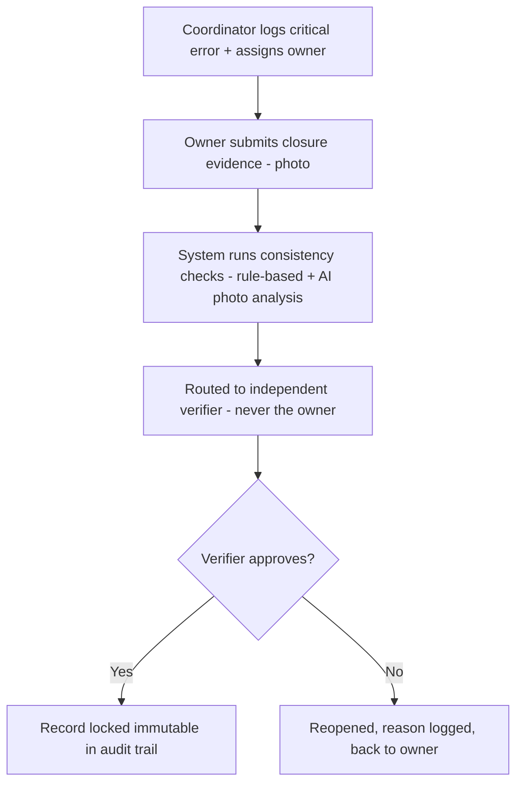
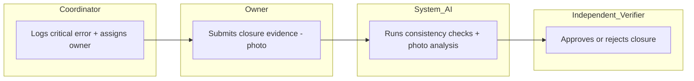

# PACKET — Business Bending, Week 6
**Gonzalo Patlán · Role: ADVERSARY · Blueprint declaration: standardized, auditable evaluation layer with independent verification, primarily honoring Condition 3**

## Problem, in my words
My own Brain Bending research found the exact failure this slice fixes: Mexico's mandatory Acta de Evaluación for school/business drills is a free-form, self-reported document signed by the same two parties who benefit from showing success — the building's legal representative and the trainer they paid. No standardized fields, no independent check, no audit trail. My slice builds the missing piece: a structured record for critical errors and corrective actions that cannot be closed by the person who owns the fix, and cannot be silently rewritten once verified.

## Exact user
The school's civil-protection coordinator, who logs a critical error found during a rehearsal (e.g. a blocked evacuation route) and assigns an owner to fix it — and a second person, an independent verifier who is never the same account as the owner, who reviews the closure evidence before the record can be marked resolved.

## Success definition
Before the module closes: a coordinator can log a critical error with a required corrective action and owner, the owner can submit closure evidence (a photo), the system flags basic consistency signals (same-day closure, owner/verifier identity conflict), and a different verifier account can approve or reject the closure — with an approved record becoming immutable in an audit trail that preserves timestamps and who signed off.

## Mockup
**Screen 1 — Log a critical error:**

**Screen 2 — Independent verifier review:**

## Flow — flowchart

## Flow — swimlane (who does what)

## Benchmark — GLOBAL to LOCAL
The best existing solution on Earth for this is **Singapore's SCDF eFSM portal** — every building's Fire Safety Manager must file an Annual Fire Safety Report with a mandatory Annex F Evacuation Drill Record Sheet, non-optional structured fields, and real legal consequences for falsifying the report.

Mine differs because Mexico lacks what makes Singapore's model work: a single territorial authority with real enforcement teeth. My Brain Bending research on the Acta de Evaluación found no equivalent legal consequence for a falsified or generic closure in Mexico's fragmented 32-state system. Since I can't import Singapore's legal deterrent, my slice substitutes a structural one: mandatory independent human verification plus AI-assisted consistency flagging, so a record can't be closed by the same person who has the incentive to close it — earning auditability through process design instead of through legal enforcement that doesn't exist here yet.

## Long view (3 years)
If this slice works, the verification layer could become the audit standard schools and companies voluntarily adopt to prove their Programa Interno de Protección Civil compliance is real, not just paperwork — eventually becoming the trusted record an insurer or a Tercero Acreditado could reference directly instead of accepting a self-reported Acta at face value. At that point it isn't a rehearsal product anymore — it's the accountability layer sitting on top of whatever rehearsal method (VR or not) a school already uses.

## Scope cut — what I am NOT building
- The rehearsal/simulation scenario itself (Regina/USER's and Ana María/TECHNOLOGIST's slice).
- The physical micro-drill scheduling and transfer-test workflow (David/OPERATOR's slice).
- The compliance-upgrade sales offer and pricing (Sebastián/MONEY's slice).
- Real forensic photo authenticity detection — the AI photo analysis is a labeled assistive flag, not a verdict, and never the final decision-maker.
- Any real integration with official Protección Civil registries — none are available to integrate with today.

## Architecture + stack

| Layer | Choice | Notes |
|---|---|---|
| Frontend | Next.js on Vercel | Two flows: coordinator/owner logging, independent verifier review |
| Auth | Supabase Auth — Google sign-in | Two account roles: coordinator/owner and verifier; same person can't approve their own closure |
| Database | Supabase Postgres | Tables: `findings` (critical error + corrective action + owner + deadline), `closures` (evidence + verifier decision) |
| Row Level Security | ON | Users see only their own school org's records; a finding's owner_id and verifier_id must differ, enforced server-side |
| AI layer (vision) | LLM API call with image input | Analyzes closure photo for relevance/genericness; labeled "análisis asistido — apoyo, no veredicto"; never blocks or auto-approves |
| ML/adaptive logic | Rule-based consistency checks | Same-day closure flag, owner/verifier identity conflict block — deterministic, not a model |
| Secrets | Vercel environment variables | No keys in repo |
| Input validation | Server-side | Required fields on finding creation; closure blocked without evidence upload; immutability enforced at the database layer post-approval |
| Seed data | Invented school, invented staff names | No real personal data, labeled fictional |

## Test plan

**Mechanical pass:** log a critical error with owner and deadline, attempt to log in as the same account to verify it (must be blocked), submit closure evidence from a second test account, confirm a same-day closure triggers the consistency flag, approve the closure and confirm the record becomes uneditable (attempt to edit and confirm it's rejected), reject a separate test closure and confirm it reopens with the reason visible. Find and fix at least one bug, redeploy.

**Persona test (Layer 1):** persona is a skeptical school civil-protection coordinator who has filled out paper Actas for years and assumes any digital version is just theater with extra steps. Walk her through logging a finding and, separately, playing the verifier role reviewing someone else's closure — via screenshots in order — narrating whether the "can't verify your own work" rule and the consistency flags actually change her sense of whether the record could be faked, or whether she'd just find a workaround (e.g. two people rubber-stamping each other). Log every point of confusion; fix the worst one before the deadline.
