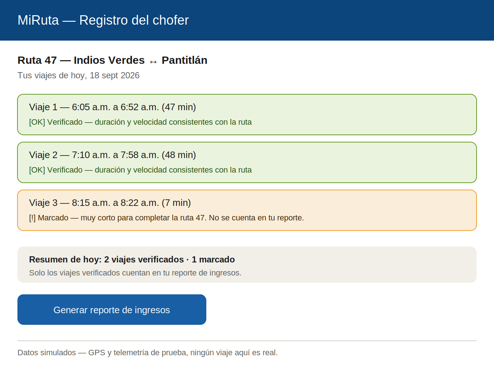
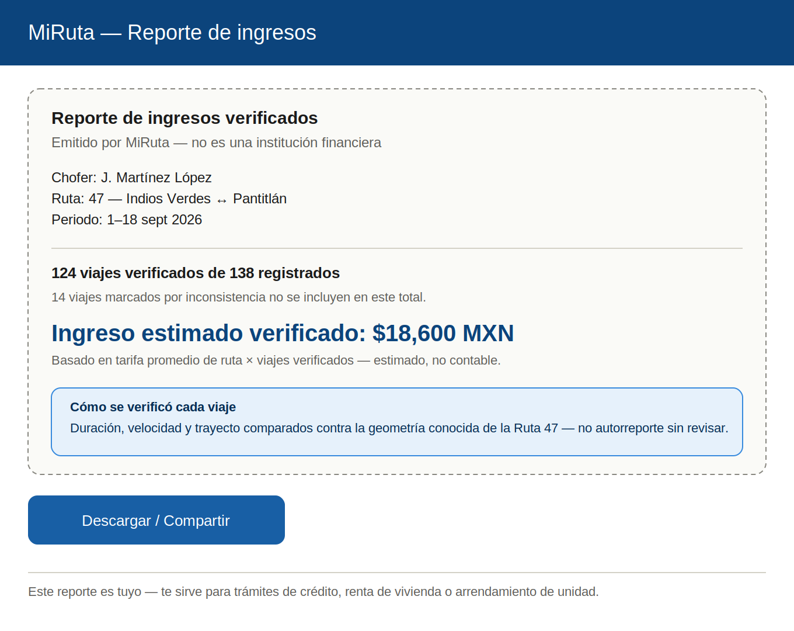
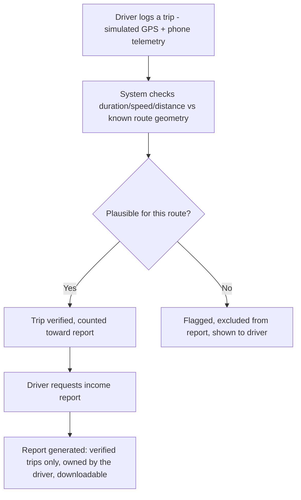
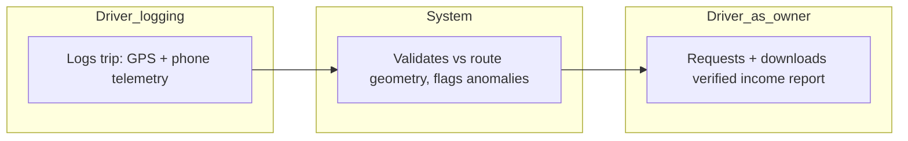

# PACKET — Business Bending, Week 7
**Gonzalo Patlán · Role: OPERATOR · Blueprint declaration: driver-first incentive that makes drivers want to keep the system running, honoring Condition 1**

## Problem, in my words
My own Brain Bending research found that every documented attempt to instrument informal transit failed the same way: it gave someone else (an owner, a regulator) visibility over the driver with nothing given back. Kenya's matatu drivers cut tracking wiring within hours of installation; what actually won mass voluntary adoption there was M-Pesa, because it solved a problem that belonged to the driver, not the owner. My slice builds the Mexican equivalent: a way for a colectivo driver to turn their own trip data into a verified income report they own — something useful for a loan, a rental application, or vehicle financing — with tracking data as the byproduct, never the pitch.

## Exact user
A colectivo driver on a fixed corridor (Ruta 47, Indios Verdes–Pantitlán) who has no formal proof of income because their earnings are cash-based and undocumented, and who needs something credible to show a bank, landlord, or vehicle-financing office.

## Success definition
Before the module closes: a driver can log a day's trips (simulated GPS + phone telemetry, labeled), the system checks each trip against the known route's expected duration/speed/distance and flags anything implausible instead of auto-counting it, and the driver can generate a verified income report — listing only verified trips, with a stated verification method — that they can download or share.

## Mockup
**Screen 1 — Driver trip log with verification status:**

**Screen 2 — Verified income report:**

## Flow — flowchart

## Flow — swimlane (who does what)

## Benchmark — GLOBAL to LOCAL
The best existing solution on Earth for this is **platform gig-work earnings statements** (Uber/DiDi's own driver earnings reports, already used informally by platform drivers for loan applications) combined with **mobile-money-based credit scoring** used across Kenya and East Africa (M-Shwari, Tala), where a driver's own transaction history becomes their credit signal without needing a bank relationship.

Mine differs because colectivo drivers have neither a platform intermediary generating an earnings record nor a mobile-money history to lean on — there's no Uber-style backend already logging their trips, and no equivalent of M-Pesa's transaction trail for cash fares collected route-side. My slice substitutes platform-mediated proof with driver-submitted trip logs cross-validated against known route geometry, since the intermediary Kenya and gig platforms rely on doesn't exist for Mexican colectivos.

## Long view (3 years)
If this slice works, the verified income layer could become a portable financial identity for informal transit workers — usable across microfinance applications, vehicle financing, or route concession renewal, following the driver even if they change routes or units. At that point it isn't a tracking tool anymore — it's the credit history informal drivers have never had access to, built from data they already generate and now own.

## Scope cut — what I am NOT building
- The passenger-facing route information app (Fernando/USER's slice).
- The economic case and identifying a real paying buyer (Money's slice).
- Proving or disproving that this vacuum is already filled by existing data (Adversary's slice).
- Any real bank or credit-bureau integration — this generates a report the driver could present, not an actual credit decision.
- Real phone GPS/accelerometer collection — this week's telemetry is simulated and clearly labeled.
- An actual machine-learned anomaly detection model — the plausibility check is rule-based (expected duration/speed range for the known route), not a trained model.

## Architecture + stack

| Layer | Choice | Notes |
|---|---|---|
| Frontend | Next.js on Vercel | Two screens: trip log, income report |
| Auth | Supabase Auth — Google sign-in | Driver accounts only; each driver sees only their own trips |
| Database | Supabase Postgres | Tables: `routes` (fixed known geometry/expected duration range), `trips` (driver_id, start/end time, simulated telemetry, status) |
| Row Level Security | ON | A driver can only see and generate reports from their own trips |
| Geodata | Fixed route definition | Ruta 47 seeded with expected distance and plausible duration/speed range |
| ML/adaptive logic | Rule-based plausibility check | Trip duration/speed compared against the route's expected range; flags outliers, does not auto-reject |
| Telemetry (3rd Dragon Stack element) | Simulated phone sensor data | A labeled synthetic speed/acceleration profile attached to each trip, used as a secondary plausibility signal alongside GPS timing |
| Secrets | Vercel environment variables | No keys in repo |
| Input validation | Server-side | Trip start/end times required and validated as a real time range before scoring |
| Seed data | Invented driver, invented route | No real personal data, labeled fictional |

## Test plan

**Mechanical pass:** log a trip with plausible duration/speed for Ruta 47 and confirm it's marked verified, log a trip with an implausible duration (too short/too fast) and confirm it's flagged and excluded from the report total, generate an income report and confirm the total only reflects verified trips, confirm a second test driver account cannot see the first driver's trips or generate a report from their data. Find and fix at least one bug, redeploy.

**Persona test (Layer 1):** persona is a skeptical colectivo driver who assumes any "tracking app" exists to monitor him for someone else's benefit (the route owner, the government) and has no reason to trust it. Walk him through the trip log and the income report screens via screenshots in order, narrating whether the framing — "this report is yours, for your own paperwork" — actually reads as driver-first, or whether it still feels like surveillance with a friendlier label. Log every point of confusion; fix the worst one before the deadline.
