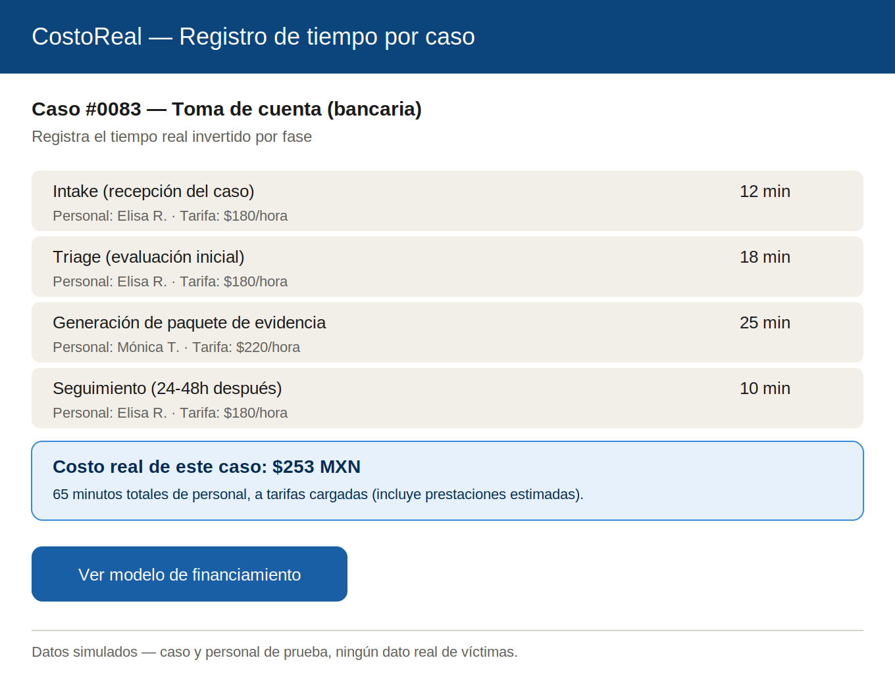
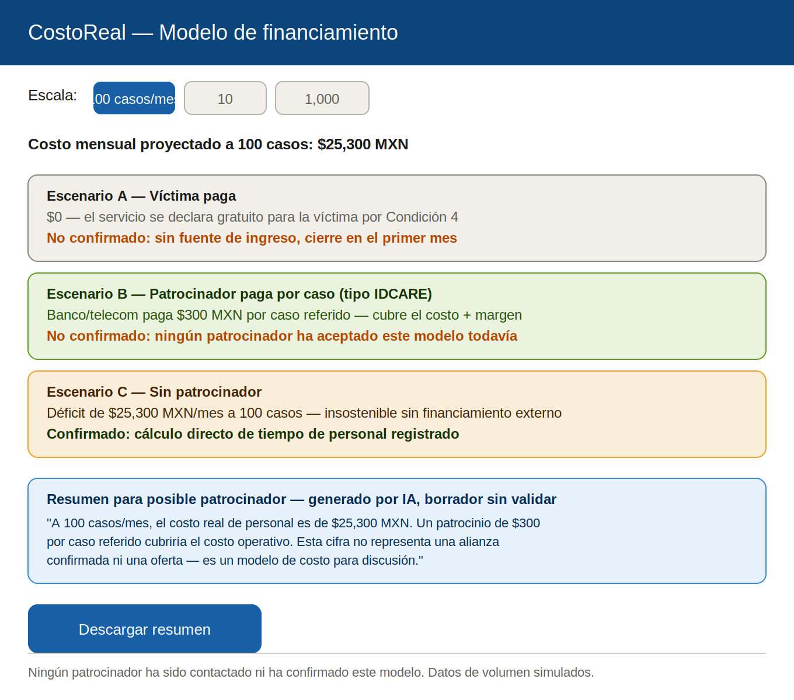
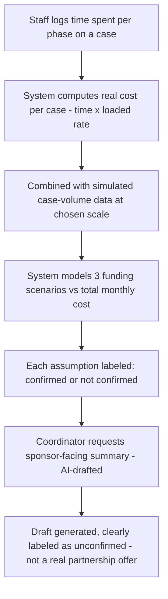
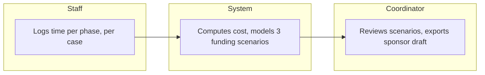

# PACKET — Business Bending, Week 8
**Gonzalo Patlán · Role: MONEY · Blueprint declaration: sponsor/channel cost model including human labor, honoring Condition 5**

## Problem, in my words
My own Brain Bending research found that no cybersecurity or breach-response service in Mexico or the benchmarks I studied survives on the victim paying directly — every working model (Coalition, IDCARE, Singapore's CSA) rides a sponsor, insurer, or channel that already has a reason to pay. Our team's Breach-Victim Service can't assume a sponsor exists just because the pattern worked elsewhere. My slice builds the tool that tells us, honestly, whether the pilot can survive: it tracks the real cost of staff time per case and models funding scenarios against it — with every unconfirmed assumption labeled as unconfirmed, per Blueprint Condition 5 ("validate funding and distribution; do not assume partnerships").

## Exact user
The pilot coordinator (Elisa's role) who needs to know, before scaling past a handful of cases, whether the service can survive financially — and, if a sponsor conversation becomes real, a one-page cost summary they can bring to that conversation without overstating what's confirmed.

## Success definition
Before the module closes: staff can log time spent per phase on a case (intake, triage, evidence packet, follow-up), the system computes the real labor cost of that case, combines it with simulated case-volume data at a chosen scale (10/100/1,000 cases/month), and shows three funding scenarios — victim pays, sponsor pays per case, no sponsor — with every claim explicitly labeled confirmed or not confirmed, and an AI-drafted sponsor-facing summary that never implies a partnership that doesn't exist.

## Mockup
**Screen 1 — Staff time/cost logging per case:**

**Screen 2 — Funding scenario comparison:**

## Flow — flowchart

## Flow — swimlane (who does what)

## Benchmark — GLOBAL to LOCAL
The best existing solution on Earth for this is **IDCARE**, Australia's national identity and cyber support service — a not-for-profit funded by an industry consortium (banks, telecoms) who pay membership fees specifically because the service reduces their own fraud-handling and call-center costs. IDCARE tracks cost per case internally to justify those sponsor fees, exactly the mechanism my slice builds.

Mine differs because Mexico has no equivalent tradition of industry-fraud collaboration or an established consortium body to replicate IDCARE's model directly — my Brain Bending research found no Mexican bank association running anything comparable. My slice localizes by testing a single-sponsor pilot cost model instead of assuming a multi-bank consortium, and by keeping every funding claim explicitly marked unconfirmed until an actual sponsor conversation happens, since — unlike IDCARE's mature market — there is zero confirmed willingness to pay in Mexico today.

## Long view (3 years)
If this slice works, the cost model becomes the standard proof-of-sustainability any state government or NGO could use to replicate the victim-response service with a confirmed bank or telecom sponsor per case — the same mechanism that let IDCARE scale nationally in Australia through sponsor fees rather than victim payment or public budget alone. At that point it isn't just a spreadsheet — it's the financial case that turns a well-intentioned pilot into something a real institution will fund.

## Scope cut — what I am NOT building
- The actual victim-facing triage tool and evidence packet generator (Andrea/USER's and Mónica/TECHNOLOGIST's slices).
- The intake queue, handoff, and 100-case capacity simulation (Elisa/OPERATOR's slice).
- The business-notification drafts and attack tests (Valeria/ADVERSARY's slice).
- Securing an actual confirmed sponsor or real payment/invoicing integration.
- Any real case data — all case volume and cost figures are simulated and clearly labeled.

## Architecture + stack

| Layer | Choice | Notes |
|---|---|---|
| Frontend | Next.js on Vercel | Two screens: time logging, funding scenarios |
| Auth | Supabase Auth — Google sign-in | Staff and coordinator accounts; RLS scoped to pilot org |
| Database | Supabase Postgres | Tables: `case_time_logs`, `case_volume_scenarios` (seeded simulated data) |
| Row Level Security | ON | Scoped to the pilot organization; no cross-org visibility |
| LLM layer | Anthropic API call, server-side | Generates the sponsor-facing draft summary; system prompt forbids inventing partnerships or confirmed figures; output always carries the "borrador sin validar" label |
| Structured data (Dragon Stack element) | Simulated case-volume dataset | Seeded distribution across case types (account takeover, impersonation, fake fundraiser) used to project cost at scale |
| Secrets | Vercel environment variables | No keys in repo |
| Input validation | Server-side | Time entries must be positive numbers; hourly rate fields bounded to plausible ranges |
| Seed data | Invented staff, invented cases | No real personal data, labeled fictional |

## Test plan

**Mechanical pass:** log time across all four phases for a test case and confirm the computed cost matches hand calculation, switch between the 10/100/1,000 case-per-month scale and confirm the monthly cost projection scales correctly, confirm each of the three funding scenarios shows the correct confirmed/not-confirmed label, generate the AI sponsor summary and confirm it never states a partnership exists or uses confirmed-sounding language for unconfirmed figures. Find and fix at least one bug, redeploy.

**Persona test (Layer 1):** persona is a skeptical nonprofit director who has seen social-tech pilots promise sustainability without real numbers before, and refuses to approach a potential sponsor with anything that overstates what's actually confirmed. Walk her through both screens via screenshots in order, narrating whether the cost model and the labeling actually earn her trust enough to take the sponsor summary into a real conversation, or whether it still reads as optimistic marketing dressed up as data. Log every point of confusion; fix the worst one before the deadline.
